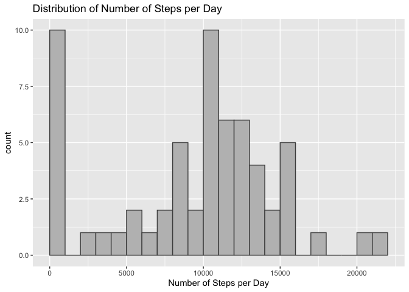
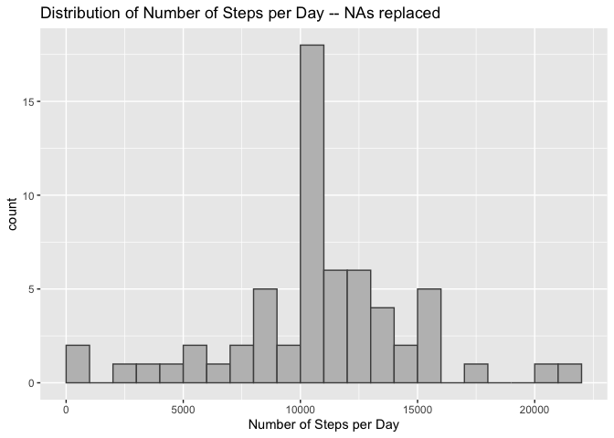

```r
# load packages
library(tidyverse)
library(lubridate)
```


## Loading and preprocessing the data

The data is loaded and we'll make sure date is a date object so we can determine
the day of the week. Also, we'll use the interval code to make a corresponding time object.


```r
df <- read_csv("activity.csv", show_col_types = FALSE)
# convert date to date format
df$date <- ymd(df$date)
# break apart interval code (hourMinute) and create a Time column.
df <- df %>% 
  mutate(Hour = interval %/% 100,
         Minutes = interval %% 100,
         Time = hms::hms(hours = Hour, minutes = Minutes)
         )
```

Take a peak at data.


```r
tail(df)
```

```
## # A tibble: 6 × 6
##   steps date       interval  Hour Minutes Time  
##   <dbl> <date>        <dbl> <dbl>   <dbl> <time>
## 1    NA 2012-11-30     2330    23      30 23:30 
## 2    NA 2012-11-30     2335    23      35 23:35 
## 3    NA 2012-11-30     2340    23      40 23:40 
## 4    NA 2012-11-30     2345    23      45 23:45 
## 5    NA 2012-11-30     2350    23      50 23:50 
## 6    NA 2012-11-30     2355    23      55 23:55
```


## What is mean total number of steps taken per day?


```r
# summarize data by date, ignorning NAs in steps
byDateSummary <- df %>% 
  group_by(date) %>% 
  summarize(stepsPerDay = sum(steps, na.rm = TRUE))

meanStepsPerDay <- as.character(round(mean(byDateSummary$stepsPerDay),2))
medianStepsPerDay <- as.character(median(byDateSummary$stepsPerDay))
```

Histogram for steps each day.


```r
ggplot(byDateSummary, aes(x = stepsPerDay)) +
  geom_histogram(binwidth = 1000, fill = "gray", color = "gray30", boundary = 0) +
  labs(title = "Distribution of Number of Steps per Day",
       x = "Number of Steps per Day")
```

<!-- -->

The mean number of steps per day is 9354.23.  
The median number of steps per day is 10395.

The large first bar seems to come from the NAs.

## What is the average daily activity pattern?

We take the average steps for each 5-minute interval, removing the NAs from the data. 


```r
by5minIntervalSummary <- df %>% 
  filter(!is.na(steps)) %>% 
  group_by(Time) %>% 
  summarize(stepsPerInterval = mean(steps, na.rm = TRUE))

maxTime <- by5minIntervalSummary$Time[which.max(by5minIntervalSummary$stepsPerInterval)]
```

**Note**: I've used the *Time* variable I created instead of *interval* since *interval* 
introduces artificial space between intervals such as 855 and 900.


```r
times <- hms(c("0:0:0", "4:0:0", "8:0:0", 
               "12:0:0", "16:0:0", "20:0:0", "24:0:0" ))

ggplot(by5minIntervalSummary, aes(x = Time, y = stepsPerInterval)) +
  geom_line() +
  scale_x_time(breaks = times) +
  labs(title = "Average Number of Steps per 5-minute Inteval",
       x = "5-minute Interval (Time)",
       y = "Average number of steps")
```

<!-- -->

The 5-minute interval with the maximum number of steps, on average, starts at the time 08:35:00.  

## Imputing missing values


```r
summary(df)
```

```
##      steps             date               interval           Hour      
##  Min.   :  0.00   Min.   :2012-10-01   Min.   :   0.0   Min.   : 0.00  
##  1st Qu.:  0.00   1st Qu.:2012-10-16   1st Qu.: 588.8   1st Qu.: 5.75  
##  Median :  0.00   Median :2012-10-31   Median :1177.5   Median :11.50  
##  Mean   : 37.38   Mean   :2012-10-31   Mean   :1177.5   Mean   :11.50  
##  3rd Qu.: 12.00   3rd Qu.:2012-11-15   3rd Qu.:1766.2   3rd Qu.:17.25  
##  Max.   :806.00   Max.   :2012-11-30   Max.   :2355.0   Max.   :23.00  
##  NA's   :2304                                                          
##     Minutes          Time         
##  Min.   : 0.00   Length:17568     
##  1st Qu.:13.75   Class1:hms       
##  Median :27.50   Class2:difftime  
##  Mean   :27.50   Mode  :numeric   
##  3rd Qu.:41.25                    
##  Max.   :55.00                    
## 
```

The summary of the data shows that NAs are only in *steps* data and that there
are 2304 NAs in total.

We'll replace these with the average for the corresponding 5-minute interval.


```r
# join with average per 5-minute interval
df_complete <- df %>% 
  left_join(by5minIntervalSummary, by = "Time")
# if steps is NA, replace with the average for that time period
df_complete <- df_complete %>% 
  mutate(steps = if_else(is.na(steps), stepsPerInterval, steps))
```

We can see that there no more NAs.


```r
summary(df_complete)
```

```
##      steps             date               interval           Hour      
##  Min.   :  0.00   Min.   :2012-10-01   Min.   :   0.0   Min.   : 0.00  
##  1st Qu.:  0.00   1st Qu.:2012-10-16   1st Qu.: 588.8   1st Qu.: 5.75  
##  Median :  0.00   Median :2012-10-31   Median :1177.5   Median :11.50  
##  Mean   : 37.38   Mean   :2012-10-31   Mean   :1177.5   Mean   :11.50  
##  3rd Qu.: 27.00   3rd Qu.:2012-11-15   3rd Qu.:1766.2   3rd Qu.:17.25  
##  Max.   :806.00   Max.   :2012-11-30   Max.   :2355.0   Max.   :23.00  
##     Minutes          Time          stepsPerInterval 
##  Min.   : 0.00   Length:17568      Min.   :  0.000  
##  1st Qu.:13.75   Class1:hms        1st Qu.:  2.486  
##  Median :27.50   Class2:difftime   Median : 34.113  
##  Mean   :27.50   Mode  :numeric    Mean   : 37.383  
##  3rd Qu.:41.25                     3rd Qu.: 52.835  
##  Max.   :55.00                     Max.   :206.170
```

Summarize by date again with NAs replaced


```r
byDateSummary_complete <- df_complete %>% 
  group_by(date) %>% 
  summarize(stepsPerDay = sum(steps, na.rm = TRUE))

meanStepsPerDay_complete <- as.character(round(mean(byDateSummary_complete$stepsPerDay),2))
medianStepsPerDay_complete <- as.character(round(median(byDateSummary_complete$stepsPerDay)))
```


```r
ggplot(byDateSummary_complete, aes(x = stepsPerDay)) +
  geom_histogram(binwidth = 1000, fill = "gray", color = "gray30", boundary = 0) +
  labs(title = "Distribution of Number of Steps per Day -- NAs replaced",
       x = "Number of Steps per Day")
```

<!-- -->

The mean number of steps per day is 10766.19.  
The median number of steps per day is 10766.

The mean has increased and many days in the first column are gone.

## Are there differences in activity patterns between weekdays and weekends?


```r
# add column to signify weekend or weekday -- Sunday = 1, Monday = 2, etc.
df_complete <- df_complete %>% 
  mutate(dayType = if_else(wday(date) == 1 | wday(date) == 7,
                           "Weekend",
                           "Weekday"
                           )
         )

byDayTypeSummary_complete <- df_complete %>% 
  group_by(dayType, Time) %>% 
  summarize(stepsPerInterval = mean(steps, na.rm = TRUE), .groups = 'drop')
```


```r
times <- hms(c("0:0:0", "4:0:0", "8:0:0", 
               "12:0:0", "16:0:0", "20:0:0", "24:0:0" ))
ggplot(byDayTypeSummary_complete, aes(x = Time, y = stepsPerInterval)) +
  geom_line() +
  scale_x_time(breaks = times) +
  facet_grid(rows = vars(dayType)) +
  labs(title = "Average Number of Steps per 5-minute Inteval",
       x = "5-minute Interval (Time)",
       y = "Average number of steps")
```

<!-- -->
 
 There seems to be a shift to later hours on the weekend and also generally more
 activity in the afternoon on weekends, less in the morning.
