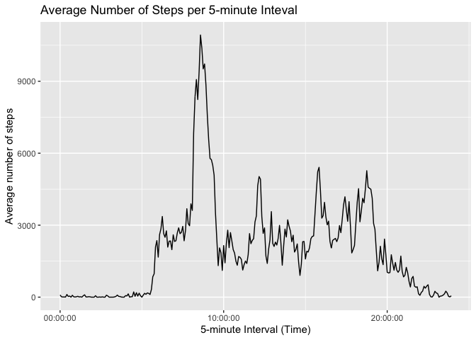

```r
# load packages
library(tidyverse)
library(lubridate)
```


## Loading and preprocessing the data


```r
df <- read_csv("activity.csv", show_col_types = FALSE)
# convert date to date format
df$date <- ymd(df$date)
df <- df %>% 
  mutate(Hour = interval %/% 100,
         Minutes = interval %% 100,
         dateTime = ymd_hm(paste(date, Hour, Minutes)))
```


## What is mean total number of steps taken per day?


```r
# summarize data by date, filtering out NAs in steps
byDateSummary <- df %>% 
  filter(!is.na(steps)) %>% 
  group_by(date) %>% 
  summarize(stepsPerDay = sum(steps, na.rm = TRUE))

meanStepsPerDay <- as.character(round(mean(byDateSummary$stepsPerDay),2))
medianStepsPerDay <- as.character(median(byDateSummary$stepsPerDay))
```

Histogram for steps each day.


```r
hist(byDateSummary$stepsPerDay, 
     breaks = 10,
     xlab = "Number of Steps per Day", 
     main = "Distribution of Number of Steps per Day")
```

<!-- -->

The mean number of steps per day is 10766.19.  
The median number of steps per day is 10765.

## What is the average daily activity pattern?


```r
by5minIntervalSummary <- df %>% 
  filter(!is.na(steps)) %>% 
  group_by(interval) %>% 
  summarize(stepsPerInterval = sum(steps, na.rm = TRUE))

maxInterval <- by5minIntervalSummary$interval[which.max(by5minIntervalSummary$stepsPerInterval)]

hours <- maxInterval %/% 100
minutes <- maxInterval %% 100
clockTime <- paste0(hours, ":", minutes)
```


```r
plot(by5minIntervalSummary$interval, by5minIntervalSummary$stepsPerInterval, 
     type = "l",
     xlab = "5-minute Interval",
     ylab = "Average number of steps",
     main = "Average Number of Steps per 5-minute Inteval")
```

<!-- -->

The 5-minute interval with the maximum number of steps, on average, is 835.  This corresponds to the interval starting at time 8:35.

## Imputing missing values


```r
summary(df)
```

```
##      steps             date               interval           Hour      
##  Min.   :  0.00   Min.   :2012-10-01   Min.   :   0.0   Min.   : 0.00  
##  1st Qu.:  0.00   1st Qu.:2012-10-16   1st Qu.: 588.8   1st Qu.: 5.75  
##  Median :  0.00   Median :2012-10-31   Median :1177.5   Median :11.50  
##  Mean   : 37.38   Mean   :2012-10-31   Mean   :1177.5   Mean   :11.50  
##  3rd Qu.: 12.00   3rd Qu.:2012-11-15   3rd Qu.:1766.2   3rd Qu.:17.25  
##  Max.   :806.00   Max.   :2012-11-30   Max.   :2355.0   Max.   :23.00  
##  NA's   :2304                                                          
##     Minutes         dateTime                  
##  Min.   : 0.00   Min.   :2012-10-01 00:00:00  
##  1st Qu.:13.75   1st Qu.:2012-10-16 05:58:45  
##  Median :27.50   Median :2012-10-31 11:57:30  
##  Mean   :27.50   Mean   :2012-10-31 11:57:30  
##  3rd Qu.:41.25   3rd Qu.:2012-11-15 17:56:15  
##  Max.   :55.00   Max.   :2012-11-30 23:55:00  
## 
```

The summary of the data shows that NAs are only in *steps* data and that there
are 2304 NAs in total.

We'll replace these with the average for the 5-minute interval.


```r
df_complete <- df %>% 
  mutate(steps2 = if_else(!is.na(steps), steps, by5minIntervalSummary$stepsPerInterval[(interval+5)%/%5]))
```


## Are there differences in activity patterns between weekdays and weekends?
